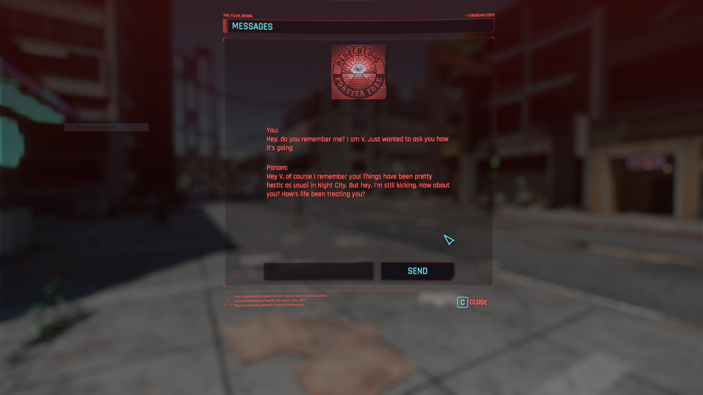

# cyberchat2077

*Cyberchat allows you to chat with in-game story-relevant NPCs in the game Cyberpunk2077. It uses OpenAI's advanced language models to generate responses.*

## Video

[YouTube demonstration](https://youtu.be/1t8nTcdxFL4)

## Installation

1) Download the latest release and necessary requirements:
    - [redscript](https://www.nexusmods.com/cyberpunk2077/mods/1511) v0.5.14 ([GitHub](https://github.com/jac3km4/redscript))
    - [RED4ext](https://www.nexusmods.com/cyberpunk2077/mods/2380) v1.15.0 ([GitHub](https://github.com/WopsS/RED4ext))
    - [CyberAI](https://www.nexusmods.com/cyberpunk2077/mods/8711) v0.1.0 ([GitHub](https://github.com/kirillkuzin/cyberpunk2077ai))
        - You need to move `CyberAI.reds` to `%CyberpunkDir%\r6\scripts\CyberAI\`
        - Make sure CyberAI is set up correctly:
            - Set your *api_key* and *org_id* in `Settings.json`
    - cyberchat-ext v1.0.0 ([GitHub](https://github.com/eeev/cyberchat2077-ext))

2) Extract the archive and move the `cyberchat2077` folder to
`%CyberpunkDir%\r6\scripts\`
    - Alternatively, add the whole `.zip` file in [Vortex](https://www.nexusmods.com/about/vortex/?)

### Usage

- While not in a vehicle, press and hold `R` (car radio button) to open the chat window
- You can now chat with story-relevant NPCs. Switch your conversation partner with the buttons at the top

### Feature Roadmap
- [ ] In-game conversation fact tracker
    - [x] Access only unlocked chat partner profiles
    - [x] Display notification when unlocking new profiles
    - [ ] (WIP) Limit or extend chat partner knowledge based on game progress

| Profile| Fact  | Knowledge | Done |
| ------------- | ------------- | ------------- | ------------- |
| Judy | `q004_judy_met`  | (Condition) | ✓ |
| Judy | `judy_knows_johnny` | Told Judy about the chip (Johnny) | |
| Judy | `judy_left_nc` | Judy left Night City (?) | |
| Evelyn | `q004_evelyn_char_entry` | (Condition) | |
| Evelyn | `q105_evelyn_found` | Recovered Evelyn barely alive | |
| Panam | `q103_panam_met` | (Condition) | ✓ |
| Johnny | `q101_johnny_char_entry` | (Condition) | ✓ |
| Rogue | `q103_rogue_met` | (Condition) | ✓ |
| Rogue | `sq031_rogue_met_johnny` | Told Rogue about the chip (Johnny) | |

### Configuration

You can edit certain variables in `.\Config\CyberChatConfig.reds` that affect the behaviour of Cyberchat:

| Variable  | Description | Example |
| ------------- | ------------- | ------------- |
| `updateInterval`  | After the user sent a message: The interval (in seconds) in which to check for responses | 2.0 |
| `chatPartnerIconPath`  | A resource identifier for the icon atlas to be loaded for chat profiles | r"base\\gameplay\\gui\\common\\icons\\avatars\\avatars1.inkatlas" |

### Commands

You can execute relevant commands by sending them as chat messages. Where applicable, they will refer to the current chat profile:

| Command  | Description |
| ------------- | ------------- |
| `/flush`  | Calls CyberAI's `FlushChat("id")` function to 'delete' chat history for this profile |
| `/update`  | Updates displayed chat messages for this profile with chat information from CyberAI  |
