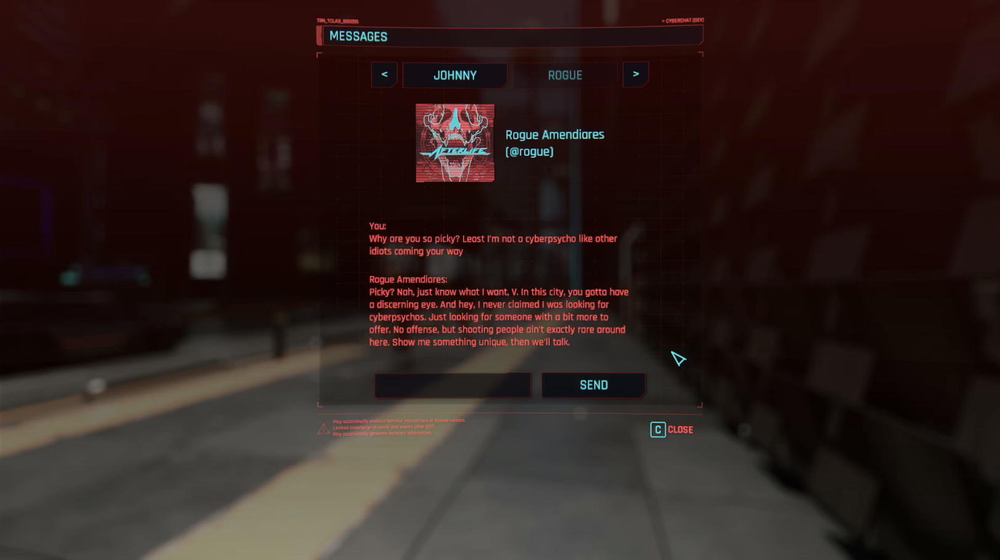

# cyberchat2077

*Cyberchat allows you to chat with in-game story-relevant NPCs in the game Cyberpunk2077. It uses OpenAI's ChatGPT advanced language model to generate responses.*

## Video

## Installation

1) Download the latest release and necessary requirements:
    - [redscript](https://www.nexusmods.com/cyberpunk2077/mods/1511) v0.5.14 ([GitHub](https://github.com/jac3km4/redscript))
    - [RED4ext](https://www.nexusmods.com/cyberpunk2077/mods/2380) v1.15.0 ([GitHub](https://github.com/WopsS/RED4ext))
    - [CyberAI](https://www.nexusmods.com/cyberpunk2077/mods/8711) v0.1.0 ([GitHub](https://github.com/kirillkuzin/cyberpunk2077ai))
        - You need to move `CyberAI.reds` to `%CyberpunkDir%\r6\scripts\CyberAI\`
        - Make sure CyberAI is set up correctly:
            - Set your *api_key* and *org_id* in `Settings.json`
2) Extract the archive and move the `cyberchat2077` folder to
`%CyberpunkDir%\r6\scripts\`
    - Alternatively, add the whole `.zip` file in [Vortex](https://www.nexusmods.com/about/vortex/?)

## Usage

- While not in a vehicle, press and hold `R` (car radio button) to open the chat
- You can now chat with story-relevant NPCs
